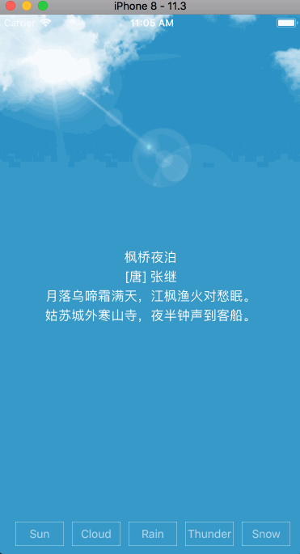
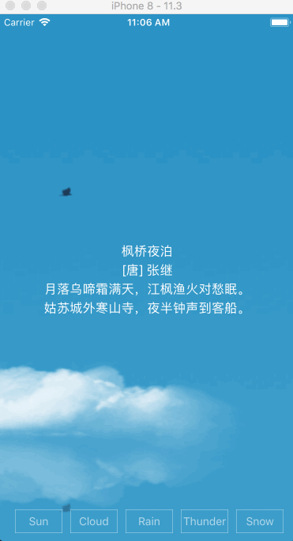
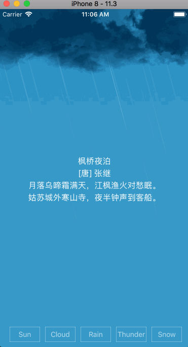
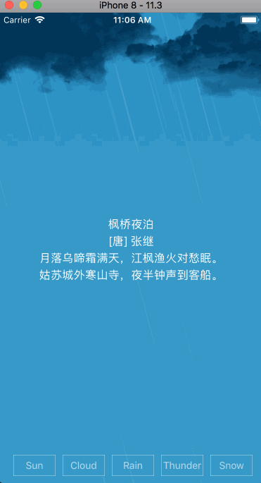
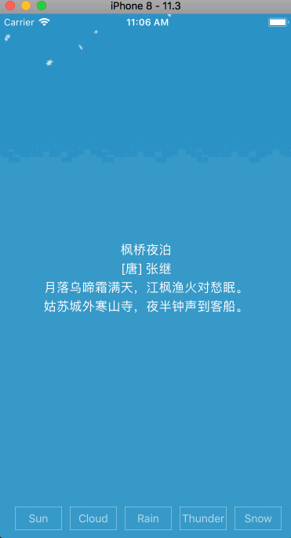

 
<div align="left">
	 
	 
	 
</div>

## WHWeatherAnimation

Animation of weather written in **Objective-C**, including **sun, cloud, rain, thunderstorm, snow** animation.











## Features

- [x] sun
- [x] cloud
- [x] rain
- [x] thunderstorm
- [x] snow
- [x] Animation transition

## Usage

#### 1. import header

```objective-c
#import "WHWeatherView.h"
```

#### 2. initialization

```objective-c
WHWeatherView *weatherView = [[WHWeatherView alloc] init];
self.weatherView.frame = self.view.bounds;
[self.view addSubview:self.weatherView];
```
#### 3. show animation

```objective-c
typedef NS_ENUM(NSInteger, WHWeatherType){
    WHWeatherTypeSun = 0,
    WHWeatherTypeClound = 1,
    WHWeatherTypeRain = 2,
    WHWeatherTypeRainLighting = 3,
    WHWeatherTypeSnow = 4,
    WHWeatherTypeOther = 5
};
```
```objective-c
- (void)showWeatherAnimationWithType:(WHWeatherType)weatherType;
```

## More

- WHWeatherAnimation has been used in this app [SiShi(思诗 - 思念诗歌，每日一诗)](https://itunes.apple.com/app/id1375960787). You can read a beautiful chinese poetry while get the daily weather forecast. Download and enjoy it.

- Here is a easy way to get the weather data.  **[心知天气](https://www.seniverse.com/)** which offered free and comprehensive APIs.

## License

WHWeatherAnimation is released under the MIT license. See LICENSE for details.

